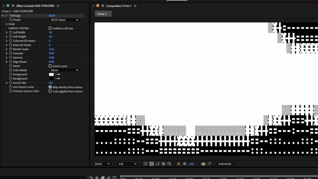

# TuiImage

[English](./README.md) | [日本語](./README.ja.md)



TuiImage is an experimental After Effects effect that converts a layer into a TUI / ASCII-like cell rendering.

It samples the source image into a grid, maps brightness to procedural glyph density, and recolors the result with mono, source, or two-color gradient modes.

> This project is still in active development. Parameter names, defaults, and rendering behavior may change before a stable release.

## Preview

The GIF above shows an early v0.1.0 preview of the effect running in After Effects.

## Naming

- Product / display name: `TuiImage`
- After Effects match name: `TuiImage`
- Plugin file name: `TuiImage.aex`

## Features

- Native After Effects effect
- Cell-based sampling of the input layer
- Procedural ASCII / block / braille-like glyph patterns
- Presets for ASCII Classic, Block, Braille, and TUI Gradient looks
- Adjustable cell size, glyph scale, column gap, and row gap
- Color modes: Mono, Source, and Gradient
- CPU rendering path enabled by default
- Experimental GPU path behind an environment variable

## Requirements

- Windows
- Adobe After Effects
- Rust toolchain, for building from source
- Permission to copy `.aex` files into the After Effects plug-ins folder

Current validation status:

- Tested on Adobe After Effects 2025 (Windows)
- macOS build and validation planned separately

Release artifacts should be built per platform from the same source revision.

## Installation

### Install a release build

Download `TuiImage.aex` from the GitHub Release page, close After Effects, then copy it to the After Effects plug-ins folder:

```text
C:\Program Files\Adobe\Common\Plug-ins\7.0\MediaCore\
```

Restart After Effects and apply the effect from:

```text
Stylize > TuiImage
```

The installer script in `scripts/install_tuiimage_admin.ps1` does the same copy step for local development, but manual copy is fine if you are not sure about running PowerShell scripts.

### Build from source

From the repository root:

```powershell
powershell -ExecutionPolicy Bypass -File .\scripts\build_release.ps1
```

This creates:

```text
rust\target\release\TuiImage.aex
```

On macOS, use the experimental local build helper:

```bash
bash ./scripts/build_macos_release.sh
```

This creates:

```text
rust/target/release/TuiImage.plugin
```

### Install a local build

Close After Effects, then run PowerShell as administrator:

```powershell
powershell -ExecutionPolicy Bypass -File .\scripts\install_tuiimage_admin.ps1
```

By default this copies the locally built `TuiImage.aex` to:

```text
C:\Program Files\Adobe\Common\Plug-ins\7.0\MediaCore\
```

If you need a custom plug-in folder, set `TUIIMAGE_PLUGIN_DIR` before running the installer script.

### Release artifacts

Do not commit generated `.aex` files to the repository. Build Windows and macOS artifacts separately from the same tagged commit, then attach those artifacts to a GitHub Release.

The macOS build helper is currently intended for local Apple Silicon testing and still needs host validation in After Effects.

## Basic Usage

1. Add `TuiImage` to a layer or precomp.
2. Choose a `Preset` to set the base glyph style.
3. Choose a `Color Mode`.
4. Adjust `Cell Width` / `Cell Height` or enable `Uniform Cell Size`.
5. Tune `Scale`, `Column Gap %`, and `Row Gap %` for the glyph layout.

Existing effect instances may keep older parameter values after updating the plugin. For clean testing, remove the effect and apply it again.

## Presets

### ASCII Classic

A rough terminal-like ASCII look using procedural glyph coverage.

### Block

A block-cell rendering style. This is a good starting point for checking density and scale.

### Braille

A dot-pattern rendering style inspired by braille-cell density.

### TUI Gradient

A block-based TUI look intended for simple two-color gradient rendering.

## Parameters

### Preset

Chooses the base glyph style and related starting values. Presets are not a separate color mode.

### Uniform Cell Size

Links `Cell Width` and `Cell Height`. When enabled, `Cell Width` is shown as `Cell Size`.

### Cell Width / Cell Height

Controls the grid size. Smaller cells give more detail but cost more processing.

### Columns / Rows

Optionally overrides the grid count. `0` means automatic calculation from cell size.

### Render Scale

Controls internal processing scale.

### Contrast / Gamma / Edge Boost / Invert

Controls source luminance mapping before glyph density is chosen.

### Color Mode

- `Mono`: maps source luma to the selected preset's glyph density, then renders filled glyph areas with Foreground over Background.
- `Source`: uses the source image color.
- `Gradient`: interpolates from Background to Foreground.

### Scale

Controls the size of the generated glyph pattern inside each cell.

- With `Uniform Scale` enabled, Column and Row scale are linked.
- With `Uniform Scale` disabled, Column and Row scale can be adjusted separately.

### Column Gap % / Row Gap %

Adds horizontal and vertical spacing inside the cell layout.

### Source Mix

Mixes the generated TUI result back toward the original source color.

### Use Source Luma

Uses source brightness to determine glyph density.

### Preserve Source Color

Colors generated glyphs using the original source image color.

## Environment

GPU rendering is experimental and disabled by default.

```powershell
$env:TUIIMAGE_ENABLE_GPU = "1"
```

## Current Limitations

- The renderer does not draw real fonts yet.
- ASCII / block / braille looks are procedural glyph-like patterns.
- Arbitrary font selection is not implemented.
- GPU rendering is experimental and disabled by default.
- The public parameter layout is still being tuned.

## Development Notes

The current goal is a practical AE-native TUI-style raster effect: editable, fast enough for experimentation, and stable enough to use directly in After Effects.

The plugin currently prioritizes controllable procedural looks over perfect terminal emulation or real font rasterization.

## License

MIT License. See [LICENSE](LICENSE).
