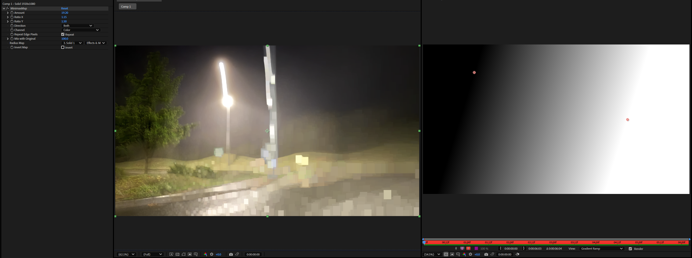

# MinimaxMap

[日本語](./README.md) | [English](./README.en.md)

MinimaxMap は、符号付きのリニアな Minimum / Maximum morphology を行う Adobe After Effects エフェクトプラグインです。



`Amount` が負の値なら Minimum、正の値なら Maximum、`0.00` なら無変化です。小数半径は隣り合う整数半径の結果をブレンドするため、`0.01` のような小さい値でも滑らかに変化します。

> 仕様、UI、パラメータ名、デフォルト値は今後変更される可能性があります。

## 名前

- 表示名: `MinimaxMap`
- After Effects match name: `MinimaxMap`
- カテゴリ: `Channel`
- プラグインファイル名:
  - Windows: `MinimaxMap.aex`
  - macOS: `MinimaxMap.plugin`

## 主な機能

- 符号付きのリニアな Minimax Amount
- 負の Amount で Minimum、正の Amount で Maximum
- `0.01` 精度の細かな morphology 制御
- Horizontal / Vertical / Both direction
- X/Y 個別の Amount 比率
- Color、Alpha、Color and Alpha モード
- Repeat Edge Pixels
- Radius Map レイヤーによるピクセル単位の強度制御
- Invert Map と Mix
- Smart Render 対応

## 検証状況

- Adobe After Effects 2026 / Windows でローカルビルドと MediaCore 配置を確認済み
- 現在の実用レンダー経路は CPU 実装
- `SmartRenderGpu` は CPU にフォールバック
- 現在のピクセル経路は ARGB 8-bit buffer
- macOS package script は用意済みですが、このマシンでは未検証

## ビルド

Adobe After Effects SDK と Rust/MSVC toolchain が必要です。Rust プロジェクトは `rust/` にあります。

Windows ではリポジトリルートから実行します。

```powershell
powershell -ExecutionPolicy Bypass -File .\scripts\build_release.ps1
```

出力:

```text
rust\target\release\MinimaxMap.aex
```

macOS では Apple Silicon Mac 上で実行します。

```bash
bash ./scripts/build_macos_release.sh
```

出力:

```text
rust/target/release/MinimaxMap.plugin
```

## インストール

### リリースビルドを使う

Windows では GitHub Releases から `MinimaxMap.aex` をダウンロードし、After Effects を終了してから plug-ins フォルダへコピーします。

```text
C:\Program Files\Adobe\Common\Plug-ins\7.0\MediaCore\
```

macOS では `MinimaxMap-macos-arm64.plugin.zip` を展開し、After Effects を終了してから `MinimaxMap.plugin` を以下へコピーします。

```text
/Library/Application Support/Adobe/Common/Plug-ins/7.0/MediaCore/
```

Gatekeeper にブロックされる場合は、必要に応じて quarantine 属性を外します。

```bash
sudo xattr -dr com.apple.quarantine "/Library/Application Support/Adobe/Common/Plug-ins/7.0/MediaCore/MinimaxMap.plugin"
```

After Effects を再起動し、`Channel > MinimaxMap` から適用します。

### ローカル Windows ビルドを入れる

After Effects を終了し、管理者 PowerShell で実行します。

```powershell
powershell -ExecutionPolicy Bypass -File .\scripts\build_release.ps1
powershell -ExecutionPolicy Bypass -File .\scripts\install_minimaxmap_admin.ps1
```

生成された `.aex` / `.plugin` は Git にコミットしません。

## パラメータ

- `Amount`: 符号付きの minimax 量。負で Minimum、正で Maximum、`0.00` で無変化
- `Ratio X` / `Ratio Y`: 横方向と縦方向の Amount 倍率
- `Direction`: Horizontal、Vertical、Both
- `Channel`: Color、Alpha、Color and Alpha
- `Repeat Edge Pixels`: 外側を端のピクセルで埋める
- `Mix with Original`: 元画像とのブレンド量
- `Radius Map`: Amount の絶対値をピクセル単位で制御する任意レイヤー
- `Invert Map`: Radius Map の影響を反転

## 開発チェック

```powershell
cd rust
cargo fmt
cargo check
cargo test
cargo build --release
```

## ライセンス

MIT License. See [LICENSE](LICENSE).
